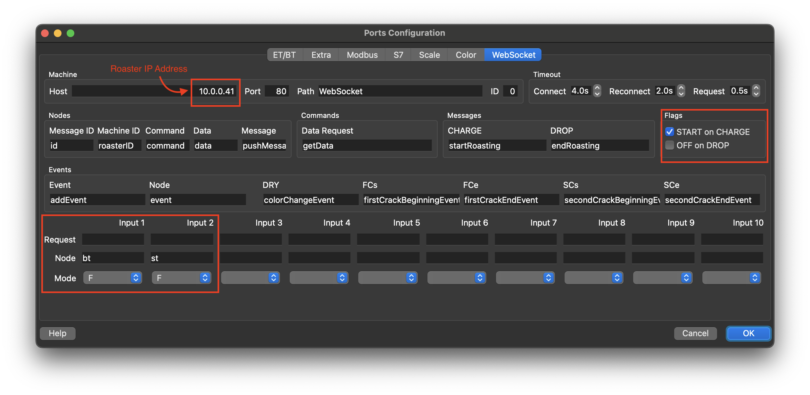
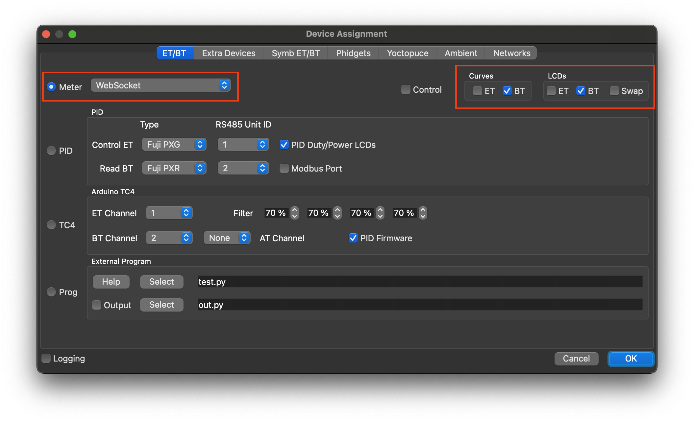
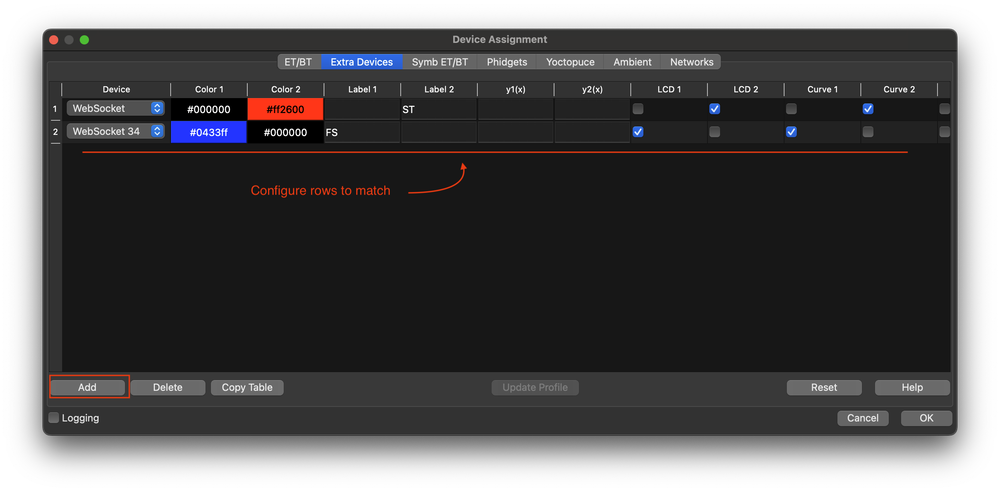
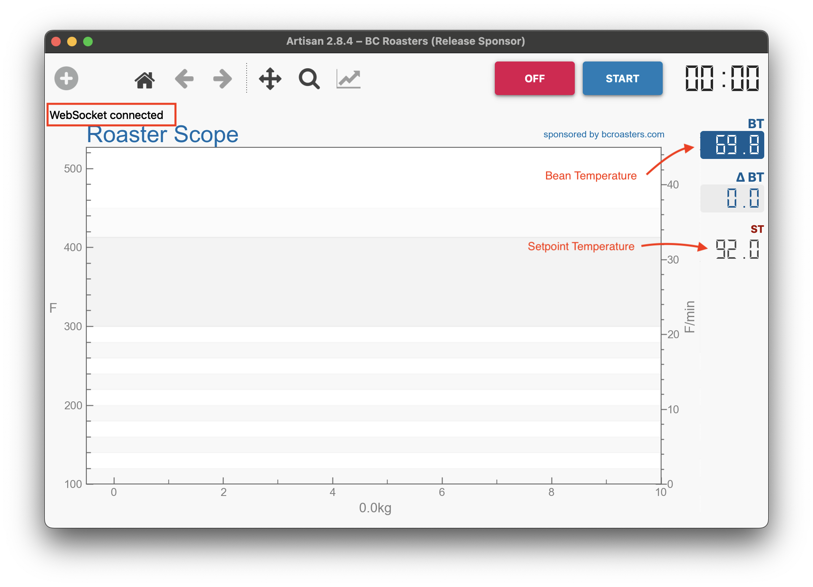

# Artisan Setup

Use this guide to connect the roaster to [Artisan](https://artisan-scope.org) for live roast logging over WebSockets.

The roaster firmware can stream roast data directly to Artisan once the device is on WiFi and the web interface is reachable.

## What You Need

- a running roaster with current firmware
- WiFi configured on the roaster
- Artisan installed on your computer
- the included settings file at `Artisan/artisan-settings.aset`

## Load The Included Settings

1. Install and open [Artisan](https://artisan-scope.org).
2. Load the included settings file from `Artisan/artisan-settings.aset` using **Help > Load Settings...**.
3. Confirm the loaded device configuration matches the roaster connection.

## Connect To The Roaster

1. Make sure the roaster is powered on and connected to your network.
2. In Artisan, enable the connection with the **ON** button.
3. Confirm Artisan shows a successful WebSocket connection and starts receiving temperature data.

## Start A Roast

1. Start the roast from the roaster UI.
2. Verify Artisan begins recording roast data automatically.
3. Watch the live curve and confirm bean and exhaust values look plausible.

## Troubleshooting

- If Artisan does not connect, verify the roaster web interface is reachable on your network first.
- If the connection succeeds but no useful data appears, confirm the correct settings file was loaded.
- If temperatures look unstable, check thermocouple wiring and the firmware web console before adjusting Artisan.

## Related Files

- [README.md](README.md) for the project overview
- [BUILD.md](BUILD.md) for hardware assembly
- [roaster-firmware/README.md](roaster-firmware/README.md) for firmware workflows