# DIY Hot Air Coffee Roaster

This repository is my latest attempt to make home coffee roasting simple, reliable, scientific, and affordable.

## Features

- Control both temperature and fan level during roast with linear interpolation between user defined setpoints.
- PID for precise temperature control.
- Send roast data wirelessly to [Artisan](https://artisan-scope.org) to visualize and record roasts.
- Uses commercial-off-the-shelf components.
- Project includes 3D printed enclosure designs, custom PCB, and build instructions.

## Build

### Case

The case is modeled in [OnShape](https://cad.onshape.com/documents/ee717da6534241d41072245e/w/709854c2acbee5e38b890bec/e/be6e653fbb47fc1f3247d478?renderMode=0&uiState=65b72c2e65c4bf7511b63553).

Print the following components. PLA works well.

- Enclosure Botton
- Enclosure Top
- 3x PCB Standoff
- Handle
- Handle - Trim
- Power Supply Mount
- 4x Feet (TPU)

Order the following:

- Screws [AliExpress](https://www.aliexpress.com/item/3256802230982244.html?spm=a2g0o.order_list.order_list_main.28.174d1802Nk9p7q)

#### Finishing (optional)

To acheive a high-gloss kitchen appliance look, use automotive spot putty, high build primer, and fine sanding pads to prepare printed parts for paint. Then use a couple coats of spray paint and clear coat.

### Electronics

The roaster controller consists of a Nextion display paired with a simple interface board containing an Arduino Nano ESP32, fan speed controller, and pin headers.

Part list:

- Order the PCB (`PCBs/Roaster Control Rev I`) [PCBWay](https://pcbway.com) [AllPCB](https://www.allpcb.com) [JLCPCB](https://jlcpcb.com)
- Nextion 3.5" Discovery Series [AliExpress](https://www.aliexpress.us/item/3256803271061345.html) [Amazon](https://www.amazon.com/gp/product/B0BBLB54XM)
- Arduino Nano ESP32 [Amazon](https://www.amazon.com/dp/B0C947BHK5)
- 1200W Popcorn Popper [Amazon](https://www.amazon.com/gp/product/B091GGYCQW)
- 24v Power Supply [Amazon](https://www.amazon.com/gp/product/B018RE4CWW)
- Power Plug Socket [Amazon](https://www.amazon.com/gp/product/B07PVP8CLT)
- DC-DC Power Supply [Amazon](https://www.amazon.com/gp/product/B01MQGMOKI)
- Motor Dimmer module [AliExpress](https://www.aliexpress.com/item/2251832615710334.html)
- JST XH2.54 Connector kit [Amazon](https://www.amazon.com/gp/product/B09DBGVX5C)
- Silicon Wire [AliExpress](https://www.aliexpress.us/item/2255800441309579.html)
- Solid-State Relay (SSR) [AliExpress](https://www.aliexpress.us/item/2255800713623525.html)
- Thermocouple Module [Amazon](https://a.co/d/eH93XEv)

## Firmware Installation

1. This project uses the Arduino IDE to intially program the Arduino Nano ESP32. Open `roaster-firmware/` directory in Arduino and upload to your Arduino Nano ESP32. The firmware supports over-the-air updates, so subsequent updates can be made by uploading a new `roaster-firmware.ino.bin` file to [http://roaster.local/update](http://roaster.local/update).
1. Copy the `Nextion/roaster1.tft` file to a microSD card and insert into the Nextion display before powering on to install the display firmware.

## Roaster modification

1. Disassemble popcorn popper by removing 4 screws at the bottom.
   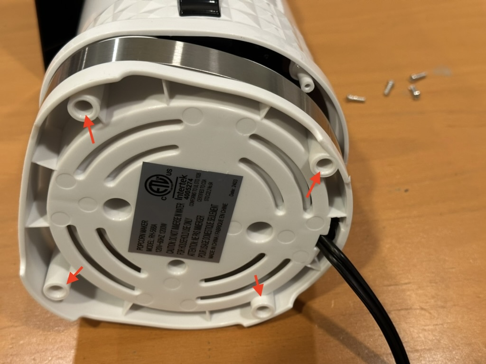
   
1. Remove popper core from base.
   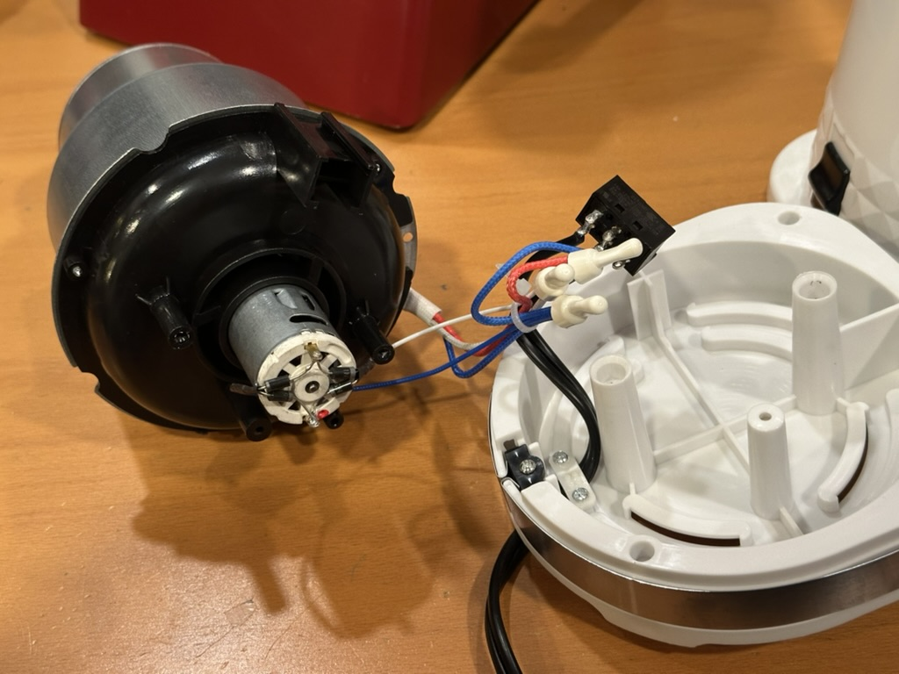
1. Remove diodes and wiring from the fan motor, and remove the connectors from the heater wires.
   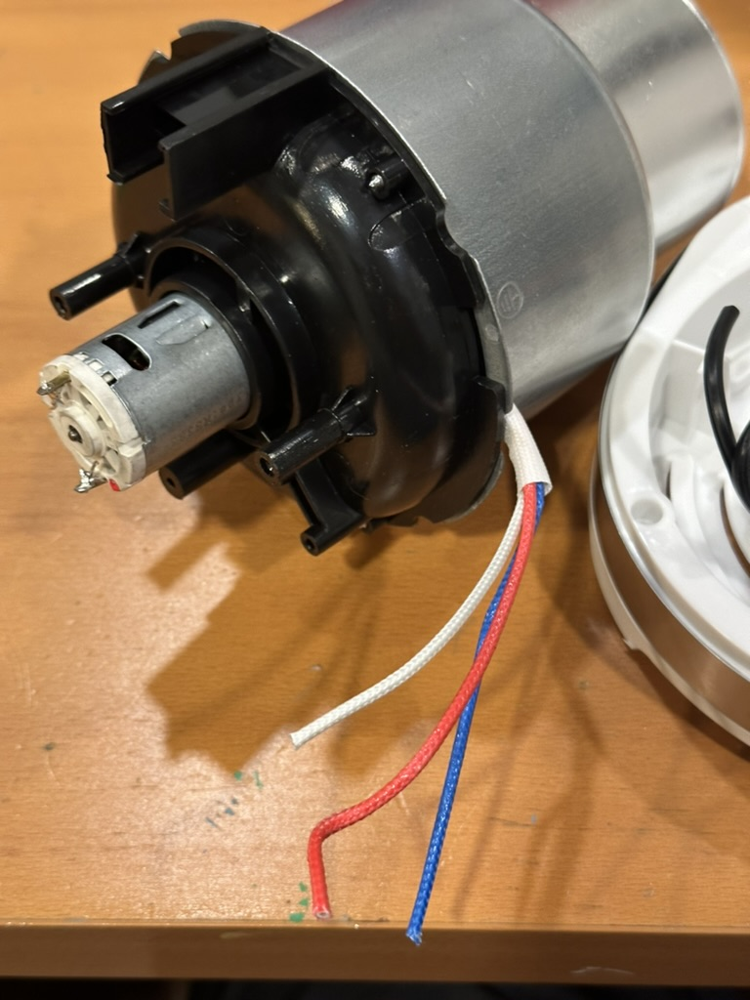
1. Remove and reassemble the motor side of the popper core to remove the bimetalic strip used to operate the popper thermostat.
   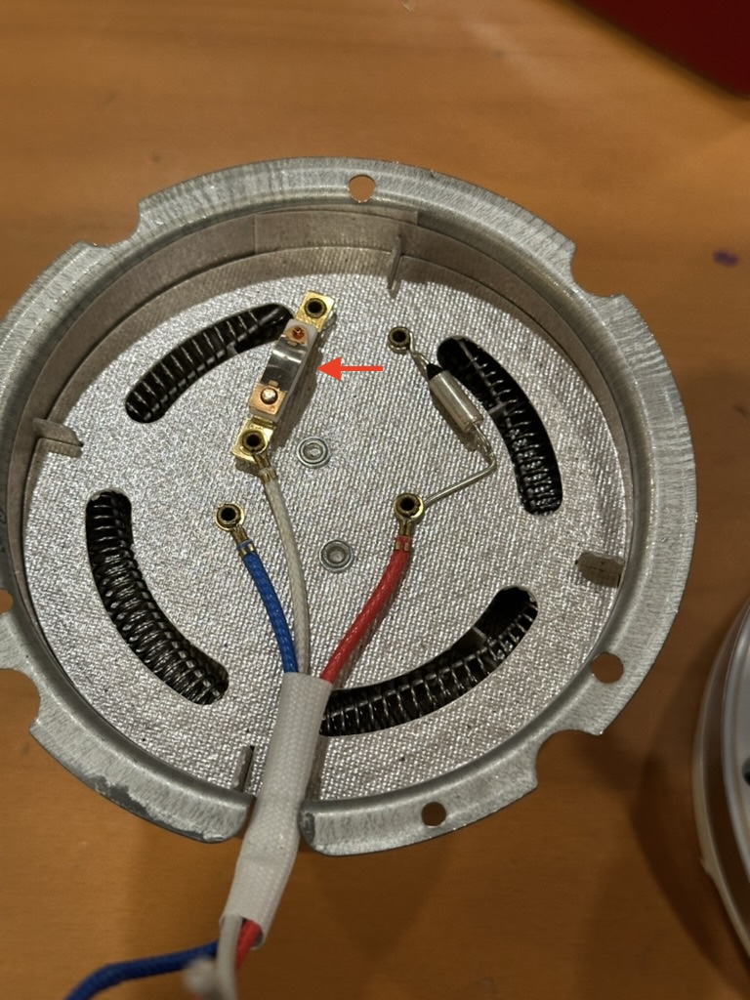
1. Remove popper power switch and replace with `Cube` printed part. This gives a place to mount the snubber circuit (to filter electrical noise generated by the motor) and makes reassembly easier.
1. Wire the motor through the snubber circuit with 22ga silicon wire.
1. Connect the heater wires as shown to 16ga silicon wire.
   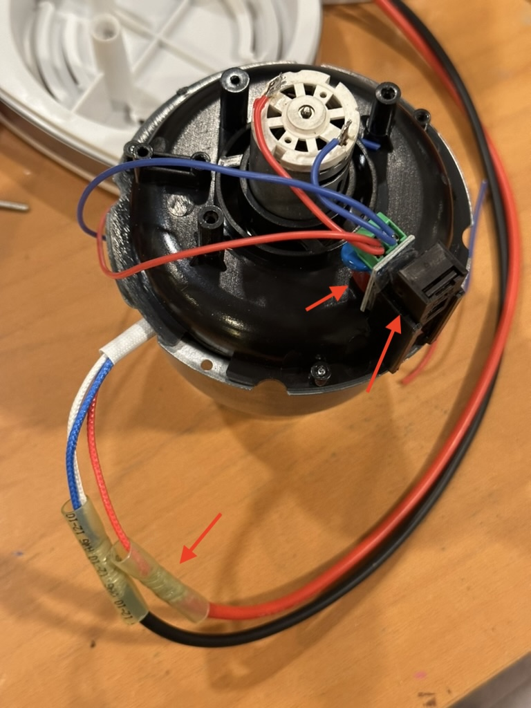
1. Reassemble the popper core to the popper base.
1. Drill a hole in the side of the roasting chamber and install the thermocouple. Remove the metal tube at the end of the thermocouple with a hacksaw, so the bare thermocouple is in contact with the hot air of the chamber.
   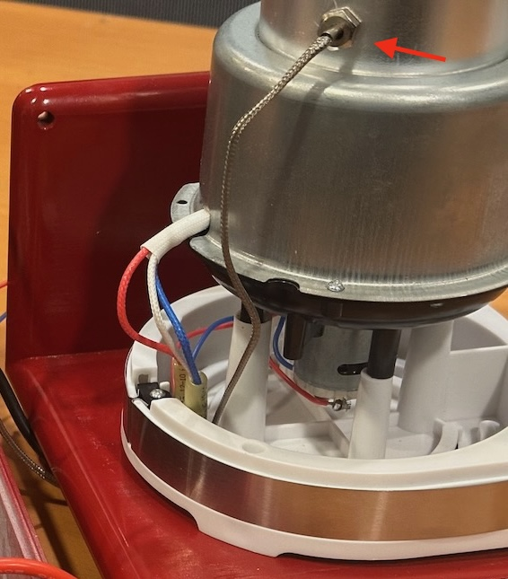
1. Mount the popper base to the `Enclosure Bottom` printed part with a couple of M4 nuts and bolts. Align the holes in the `Enclosure Bottom` with the popper base screw holes, and drill a hole in the popper base to match the mounting holes in the middle. Run the wires through the slot in the base.
   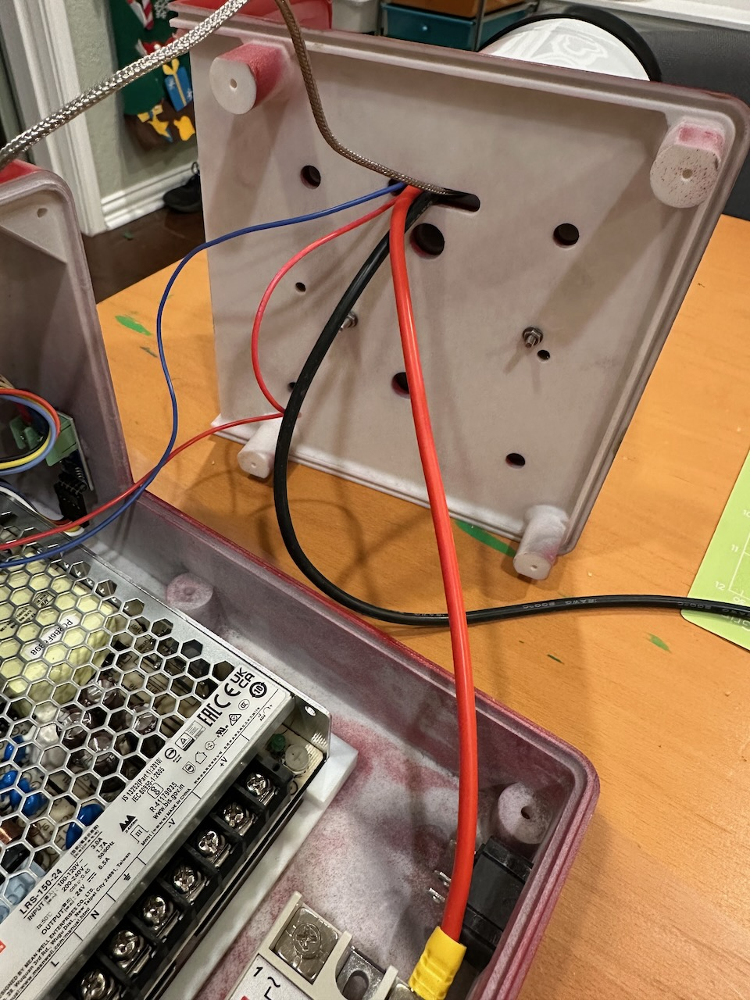

## Assembly

1. Build wire assemblies.
   
1. Use superglue to attach the 4x feet, the 3x PCB standoffs and power supply mount. For the power supply mount, make sure it's roughly in the middle and doesn't intefere with any holes.
   
1. Attach the display, Roaster Control PCB, and thermocouple module to the case with small screws.
1. Wire it up!
   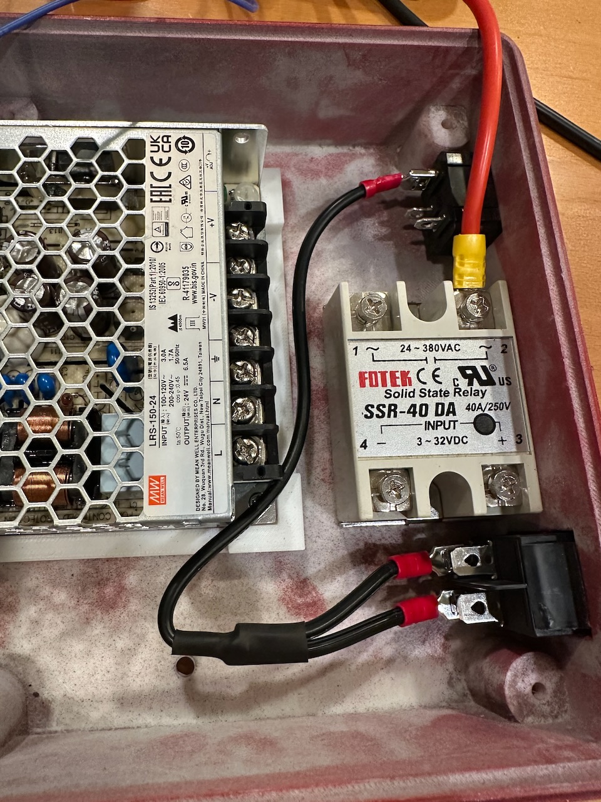
   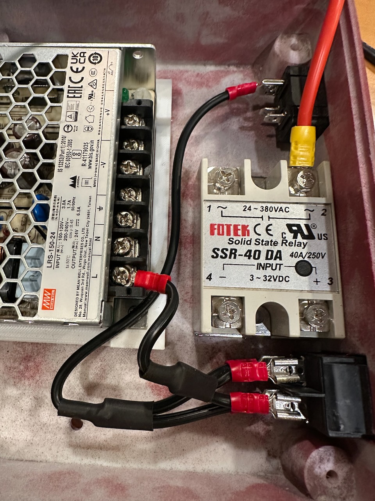
   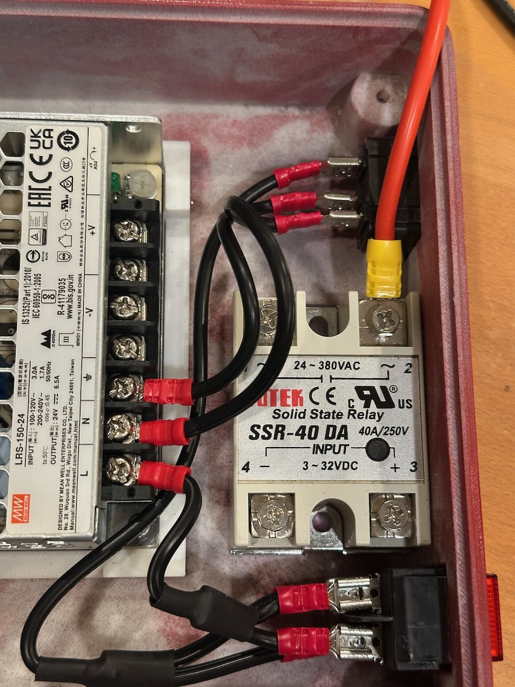
   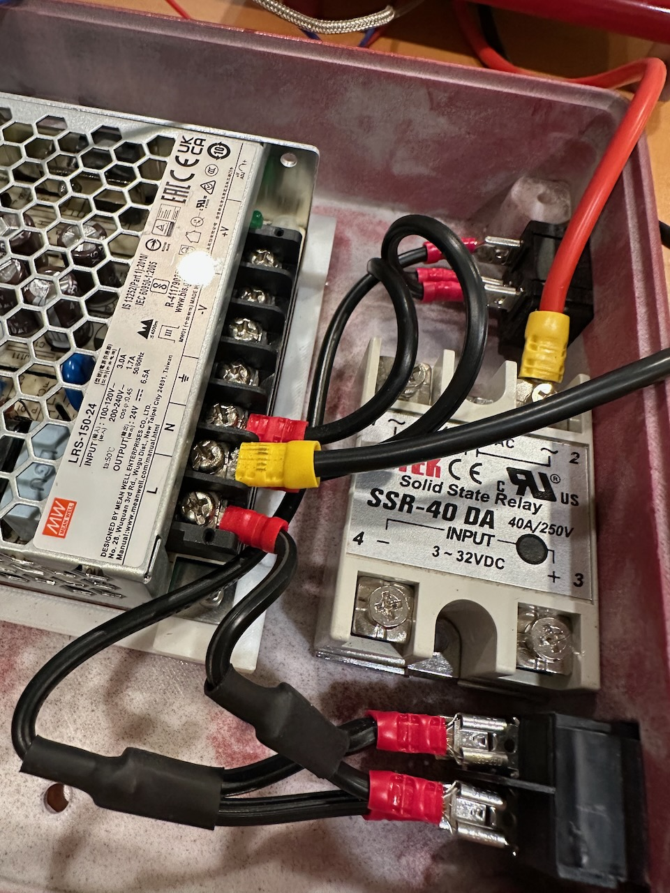
   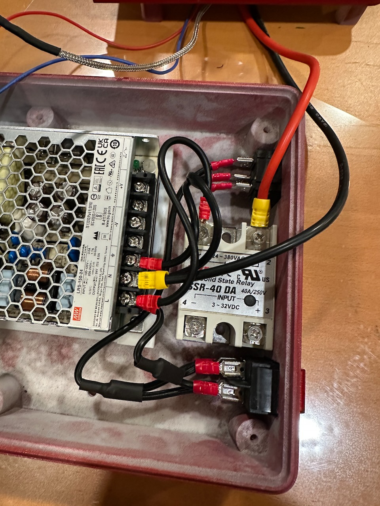
   

## Software Configuration

1. (Optional) Configure WiFi. Navigate to **Settings»WiFi** and enter your WiFi credentials.

## Artisan

Send roast data wirelessly to [Artisan](https://artisan-scope.org) to visualize and record roasts.

### Configure Artisan

1. Download and install [Artisan](https://artisan-scope.org)
2. Configure the Artisan to connect to the Roaster via WebSockets. Apply the `Artisan/astisan-settings.aset` file (**Help»Load Settings…**) or manually configure the settings as documented below.
   1. Configure Port settings (**Config»Port…**)
      
   2. Configure Device settings (**Config»Device…**)
      
      

### Run

1. Press the **ON** button to enable the Roaster connection. You should `WebSocket connected` along with the current roaster and setpoint temperatures.
   
2. Press **Start Roast** on the Roaster and the recording should automatically start within Artisan.
